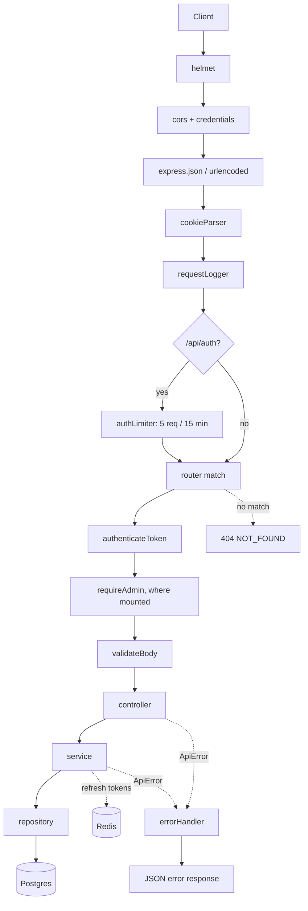
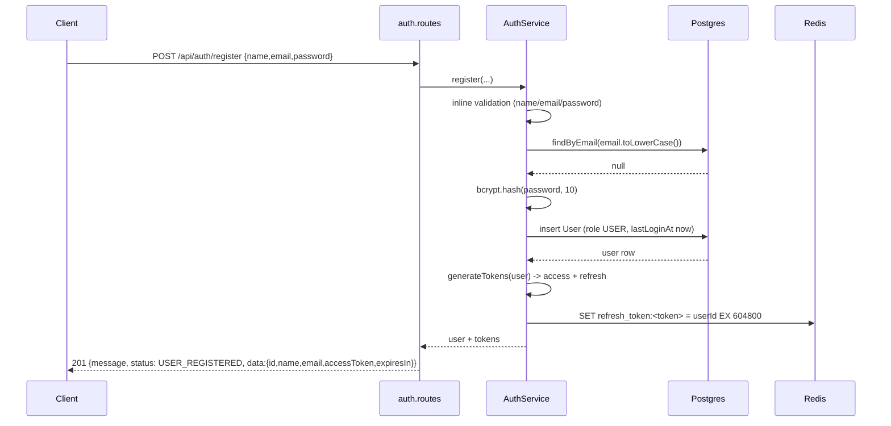
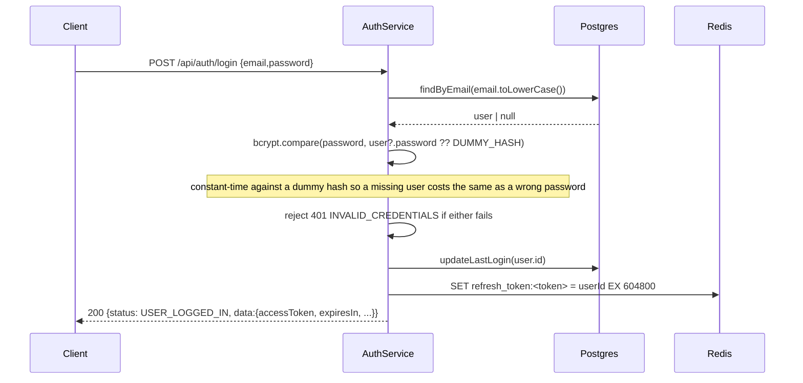
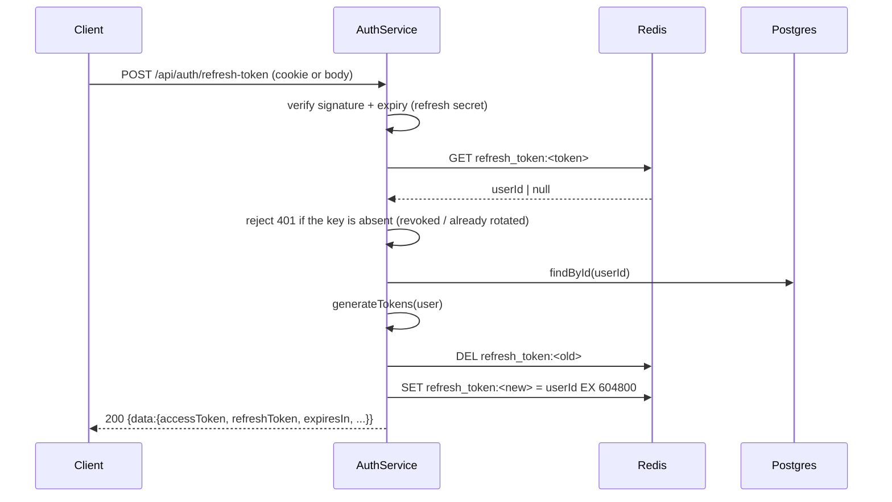
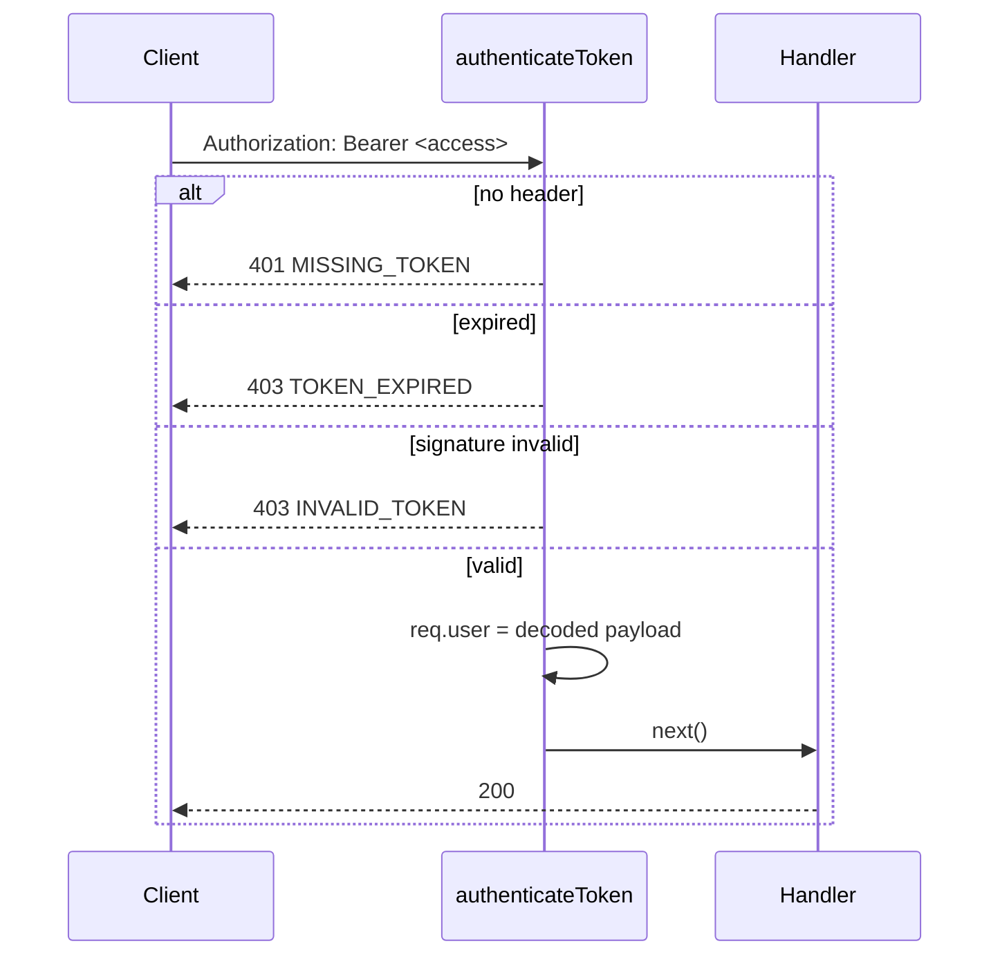
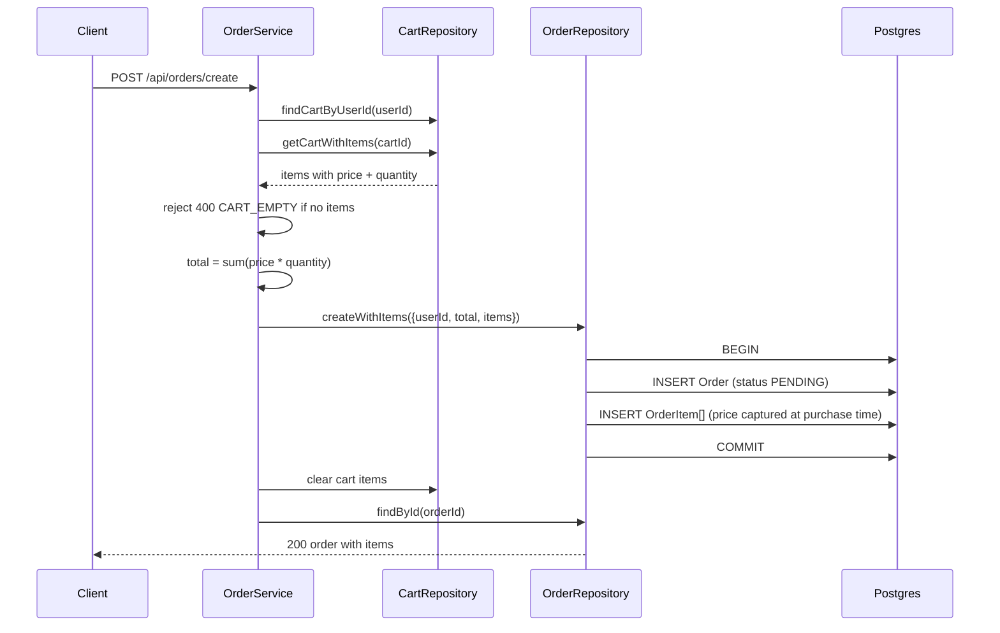

# Data Flow

## Request lifecycle

Every request takes the same path. Cross-cutting middleware runs first, then exactly one route handler.



Response envelope: success returns the resource or `{ status, message, data }`; failure returns `{ error }` or `{ status: "error", message, code }` depending on the module. Shapes are stable per endpoint — clients depend on them.

## Authentication

### Register



The refresh token is also set as an httpOnly cookie; the body carries only the access token.

### Login



### Refresh (rotation)



Any failure returns `401 INVALID_REFRESH_TOKEN`. The old token is dead the moment the new one is issued.

### Protected request



The access token carries `id`, `email`, and `role`. `role` is what `requireAdmin` reads — without the claim in the payload every admin route fails closed.

Revocation is not per-request: the access token stays valid until it expires (15m). Password change and account deletion call `revokeUserTokens(userId)`, which scans Redis for every key whose value is that user and deletes it — killing refresh, not the live access token.

## Checkout: cart to order



Two things to know:

- `OrderItem.price` is a snapshot. Changing a product price later does not rewrite past orders.
- Checkout consumes the cart. The same items are not orderable twice.

`Order.userId` is unique at the database level, so a user has at most one order row. Revisit before supporting repeat purchases — the fix is dropping that unique index and letting orders accumulate.

## Cart operations

`POST /api/cart/add` looks up the product (404 `PRODUCT_NOT_FOUND` if absent), finds or creates the user's cart, then upserts the line: increment when `(cartId, productId)` already exists, insert otherwise.

`GET /api/cart` returns `{ id: null, items: [], total: 0 }` when no cart exists rather than a 404 — an empty cart is a valid state.

## Admin flows

The parent admin router mounts `authenticateToken` and `requireAdmin` once, so every route below it — including the nested dashboard router — is covered by the same guard. A non-admin gets `403 FORBIDDEN` before any handler runs.

`GET /api/admin/orders` inner-joins users, left-joins order items and products, groups rows into orders with a nested `items` array, and returns `{ orders, pagination: { total, page, totalPages, limit } }`. Default page size is 50. An invalid `status` filter reaches Postgres and surfaces as a 500 — the enum rejects it before the app can.

`GET /api/admin/dashboard/stats` reports `totalUsers`, `activeUsers` (logged in within 30 days), and `newUsers` (created within 30 days).

## Data model

```mermaid
erDiagram
    User ||--o| Cart : "has (app-enforced one)"
    User ||--o| Order : "has at most one"
    Cart ||--o{ CartItem : contains
    Order ||--o{ OrderItem : contains
    Product ||--o{ CartItem : "referenced by"
    Product ||--o{ OrderItem : "referenced by"
    Category ||--o{ Product : groups

    User {
        text id PK
        text email UK
        text name
        text password
        UserRole role
        boolean isEmailVerified
        timestamp lastLoginAt
        int phone
        timestamp createdAt
        timestamp updatedAt
    }
    Product {
        text id PK
        text name
        text description
        float price
        text image_url
        text sku UK
        text categoryId FK
    }
    Category {
        text id PK
        text name
    }
    Cart {
        text id PK
        text userId FK
    }
    CartItem {
        text id PK
        text cartId FK
        text productId FK
        int quantity
    }
    Order {
        text id PK
        text userId FK_UK
        float total
        OrderStatus status
    }
    OrderItem {
        text id PK
        text orderId FK
        text productId FK
        int quantity
        float price
    }
```

Enums: `UserRole` = `ADMIN | USER`, `OrderStatus` = `PENDING | PROCESSING | COMPLETED | CANCELLED`.

Foreign keys cascade on delete for every required relation; `Product.categoryId` is the exception and sets null, so deleting a category leaves its products in place.

Two schema facts worth flagging before they surprise someone:

- `Cart.userId` has no unique constraint, so the schema permits several carts per user. Application code (`findOrCreateCart`) treats it as one. A unique index would make that explicit.
- `Order.userId` is unique, which is what caps a user at a single order.

## Migrations

Model changes flow one way:

```
model.ts  --drizzle-kit generate-->  src/db/migrations/NNNN_*.sql
                                            |
                                    app/migrate.ts applies it
                                            |
                                  __drizzle_migrations (file hash)
```

The runner skips any file whose hash is already recorded, and treats duplicate-object Postgres errors as already-applied. Adding a module means adding its model to `src/db/postgres.schema.ts`, or the generator will not see the tables.
